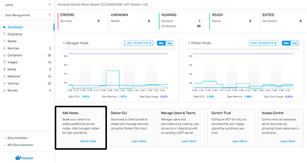
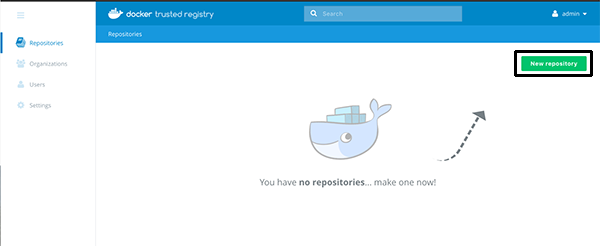
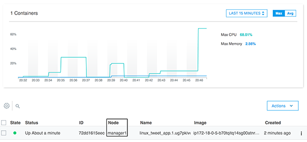
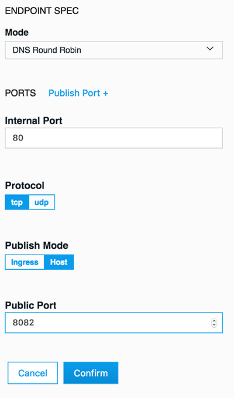
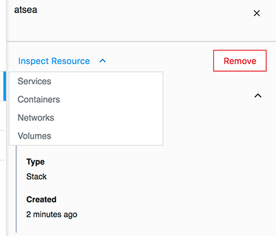

# Deploying Multi-OS applications with Docker EE

## (Play With Docker Version)

Docker EE 17.06 is the first Containers-as-a-Service platform to offer production-level support for the integrated management and security of Linux AND Windows Server Containers.

In this lab we'll use a Docker EE cluster comprised of Windows and Linux nodes. We'll deploy both a Linux and Windows web app, as well as a multi-service application that includes both Windows and Linux components. We will then look at scaling up your web app, as well how Docker EE handles system interruptions and upgrades.

> **Difficulty**: Intermediate (assumes basic familiarity with Docker)

> **Time**: Approximately 75 minutes

> **Tasks**:
>
> * [Task 1: Configure the Docker EE Cluster](#task1)
>   * [Task 1.1: Accessing PWD](#task1.1)
>   * [Task 1.2: Install a Windows worker node](#task1.2)
>   * [Task 1.3: Create Two Repositories](#task1.3)
> * [Task 2: Deploy a Linux Web App](#task2)
>   * [Task 2.1: Clone the Demo Repo](#task2.1)
>   * [Task 2.2: Build and Push the Linux Web App Image](#task2.2)
>   * [Task 2.3: Deploy the Web App using UCP](#task2.3)
> * [Task 3: Deploy a Windows Web App](#task3)
>   * [Task 3.1: Create the Dockerfile with Image2Docker](#task3.1)
>   * [Task 3.2: Build and Push Your Image to Docker Trusted Registry](#task3.2)
>   * [Task 3.3: Deploy the Windows Web App](#task3.3)
> * [Task 4: Deploy a Multi-OS Application](#task4)
>   * [Task 4.1: Examine the Docker Compose File](#task4.1)
>   * [Task 4.2: Deploy the Application Stack](#task4.2)
>   * [Task 4.3: Verify the Running Application](#task4.3)
> * [Task 5: Application Lifecycle Management](#task5)
>   * [Task 5.1: Upgrading the Web Front-end](#task5.1)
>   * [Task 5.2: Scaling the Web Front-end](#task5.2)
>   * [Task 5.3: Dealing with an Application Failure](#task5.3)

## Understanding the Play With Docker Interface


There are three main components to the Play With Docker (PWD) interface

### 1. Console Access
Play with Docker provides access to the 3 Docker EE hosts in your Cluster. These machines are:

* A Linux-based Docker EE 17.06 Manager node
* A Linux-based Docker EE 17.06 Worker node
* A Windows Server 2016-based Docker EE 17.06 Worker Node

By clicking a name on the left, the console window will be connected to that node

### 2. Access to your Universal Control Plane (UCP) and Docker Trusted Registry (DTR) servers

Additionally, the PWD screen provides you one-click access to the Universal Control Plane (UCP)
web-based management interface as well as the Docker Trusted Registry (DTR) web-based management interface. Click on either the `UCP` or `DTR` button will bring up the respective server web interface in a new tab.

### 3. Session Information

Throughout the lab you will be asked to provide either hosntnames or login credentials that are unique to your environment. These are displayed for you at the bottom of the screen.

## Document conventions

- When you encounter a phrase in between `<` and `>`  you are meant to substitute in a different value.

	For instance if you see `<dtr domain>` you would actually type something like `ip172-18-0-7-b70lttfic4qg008cvm90.direct.microsoft.play-with-docker.com`

- When you see the Linux penguin all the following instructions should be completed in your Linux console

	

- When you see the Windows flag all the subsequent instructions should be completed in your Windows cosnsole.

	

## <a name="task1"></a>Task 1: Configure the Docker EE Cluster

The Play with Docker (PWD) environment is almost completely setup, but before we can begin the labs we need to do two more steps. First we'll add a Windows node to the cluster, and then we'll create two repositories on the DTR server.

### <a name="task 1.1"></a>Task 1.1: Accessing PWD

1. Navigate in your web browswer to [the PWD environment sign-in page](https://goto.docker.com/2017PWDonMicrosoftAzure_MTALP.html)

	> **Note**: You might want to right click the above link and open it in a new tab or window

2. Fill out the form, and click `submit`. You will then be redirected to the PWD environment.

3. Click `Access`

	It will take a few minutes to provision out your PWD environment. After this step completes, you'll be ready to move on to step 1.2: Install a Windows worker node

### <a name="task1.2"></a>Task 1.2: Install a Windows worker node

Let's start by adding our 3rd node to the cluster, a Windows Server 2016 worker node.

1. From the main PWD screen click the `UCP` button on the left side of the screen

	> **Note**: Because this is a lab-based install of Docker EE we are using the default self-signed certs. Because of this your browser may display a security warning. It is safe to click through this warning.
	>
	> In a production environment you would use certs from a trusted certificate authority and would not see this screen.
	> 

2. When prompted enter your username and password (these can be found below the console window in the main PWD screen). The UCP web interface should load up in your web browser.

	> **Note**: Once the main UCP screen loads you'll notice there is a red warning bar displayed at the top of the UCP screen, this is an artifact of running in a lab environment. A UCP server configured for a production environment would not display this warning
	>
	> 


3. From the main dashboard screen, click `Add a Node` on the bottom left of the screen

	

4. Copy the text from the dark box shown on the `Add Node` screen.

	> **Note** There is an icon in the upper right corner of the box that you can click to copy the text to your clipboard
	> 


	> **Note**: You may notice that there is a UI component to select `Linux` or `Windows`on the `Add Node` screen. In a production environment where you are starting from scratch there are [a few prerequisite steps] to adding a Windows node. However, we've already done these steps in the PWD envrionemnt. So for this lab, just leave the selecton on `Linux` and move on to step 2


6. Switch back to the PWD interface, and click the name of your Windows node. This will connect the web-based console to your Windows Server 2016 Docker EE host.

7. Paste the text from Step 4 at the command prompt in the Windows console.

	You should see the message `This node joined a swarm as a worker.` indicating you've successfully joined the node to the cluster.

5. Switch back to the UCP server in your web browser and click the `x` in the upper right corner to close the `Add Node` window

6. You should be taken to the `Nodes` screen will will see 3 nodes listed at the bottom of your screen.

	After a minute or two refresh your web browswer to ensure that your Windows worker node has come up as `healthy`

	

Congratulations on adding a Windows node to your UCP cluster. Next up we'll create a couple of repositories in Docker Trusted registry.

### <a name="task1.3"></a>Task 1.3: Create Two DTR Repositories

Docker Trusted Registry is a special server designed to store and manage your Docker images. In this lab we're going to create a couple of different Docker images, and push them to DTR. But before we can do that we need to setup respositories in which those images will reside.

1. In the PWD web interface click the `DTR` button on the left side of the scree.

	> **Note**: As with UCP before, DTR is also using self-signed certs. It's safe to click through any browser warning you might encoutner.

2. From the main DTR page click `New Repository`. This brings up the new repository dialog

	

3. Under `REPOSITORY NAME` type `linux_tweet_app`. Leave the rest of the values the same, and click `Save`

	Let's repeat this process to create a repository for our Windows tweet app.

4. Once again, click the green `New repository` button.

5. Under `REPOSITORY NAME` type `windows_tweet_app`. Leave the rest of the values the same, and click `Save`


	

Congratulations you have created two new repositories.

## <a name="task2"></a>Task 2: Deploy a Linux Web App

Now that we've completely configured our cluster, let's deploy a couple of web apps. These are simple web pages that allow you to send a tweet. One is built on Linux using NGINX and the other is build on Windows Server 2016 using IIS.  

Let's start with the Linux version.

### <a name="task2.1"></a> Task 2.1: Clone the Demo Repo


1. From PWD click on on the `worker1` link on the left to connnect your web console to the UCP Linux worker node.

2. Use git to clone the workshop repository.

	```
	$ git clone https://github.com/mikegcoleman/hybrid-workshop.git
	```

	You should see something like this as the output:

	```
	Cloning into 'hybrid-workshop'...
	remote: Counting objects: 13, done.
	remote: Compressing objects: 100% (10/10), done.
	remote: Total 13 (delta 1), reused 10 (delta 1), pack-reused 0
	Unpacking objects: 100% (13/13), done.
	Checking connectivity... done.
	```

	You now have the necessary demo code on your worker host.

### <a name="task2.2"></a> Task 2.2: Build and Push the Linux Web App Image


1. Change into the `linux_tweet_app` directory.

	`$ cd ./hybrid-workshop/linux_tweet_app/`

2. Use `docker build` to build your Linux tweet web app Docker image.

	`$ docker build -t <dtr hostname>/<your user name>/linux_tweet_app .`

	> **Note**: Be sure to substitute your DTR Hostname and your User Name - both these are listed at the top of your PWD page.

	The `-t` tags the iamge with a name. In our case the name indicates which DTR server and under which user's respository the image will live.

	> **Note**: Feel free to examine the Dockerfile in this directory if you'd like to see how the image is being built.

	Your output should be similar to what is shown below

	```
	Sending build context to Docker daemon  4.096kB
	Step 1/4 : FROM nginx:latest
	latest: Pulling from library/nginx
	ff3d52d8f55f: Pull complete
	b05436c68d6a: Pull complete
	961dd3f5d836: Pull complete
	Digest: sha256:12d30ce421ad530494d588f87b2328ddc3cae666e77ea1ae5ac3a6661e52cde6
	Status: Downloaded newer image for nginx:latest
	 ---> 3448f27c273f
	Step 2/4 : COPY index.html /usr/share/nginx/html
	 ---> 72d22997a765
	Removing intermediate container e262b9220942
	Step 3/4 : EXPOSE 80 443
	 ---> Running in 54e4ff1b39a6
	 ---> 2b5bd87894cd
	Removing intermediate container 54e4ff1b39a6
	Step 4/4 : CMD nginx -g daemon off;
	 ---> Running in 54020cdec942
	 ---> ed5f550fc339
	Removing intermediate container 54020cdec942
	Successfully built ed5f550fc339
	Successfully tagged  <dtr hostname>/<your user name>/linux_tweet_app:latest
	```

3. Log into your DTR server from the command line

	```
	$ docker login <dtr hostname>
	Username: <your username>
	Password: <your password>
	Login Succeeded
	```
4. Use `docker push` to upload your image up to Docker Trusted Registry.

	```
	$ docker push <dtr hostname>/<your user name>/linux_tweet_app
	```

	The output should be similar to the following:

	```
	The push refers to a repository [<dtr hostname>/<your user name>/linux_tweet_app]
	feecabd76a78: Pushed
	3c749ee6d1f5: Pushed
	af5bd3938f60: Pushed
	29f11c413898: Pushed
	eb78099fbf7f: Pushed
	latest: digest: sha256:9a376fd268d24007dd35bedc709b688f373f4e07af8b44dba5f1f009a7d70067 size: 1363
	```

4. In your web browser head back to your DTR server and click `View Details` next to your `linux_tweet_app` repo to see the details of the repo.

	> **Note**: If you've closed the tab with your DTR server, just click the `DTR` button from the PWD page.

5. Click on `Images` from the horizontal menu. Notice that your newly pushed image is now on your DTR.

### <a name="task2.3"></a> Task 2.3: Deploy the Web App using UCP

Now let's run our application by by creating a new service.

Services are application building blocks (although in many cases an application will only have one service, such as this example). Services are based on a single Docker image. When you create a new service you instantiate at least one container automatically, but you can scale the number up (or down) to meet the needs of your service.

1. Switch back to your UCP server in your web broswer

	> **Note**: If you've closed your UCP tab, you can simply click `UCP` from the PWD page to relaunch the UCP web interface

2. In the left hand menu click `Services`

3. In the upper right corner click `Create Service`

4. Enter `linux_tweet_app` for the name.

4. Under `Image` enter the path to your image which should be `<dtr hostname>/<your user name>/linux_tweet_app`

8. From the left hand menu click `Network`

9. Click `Publish Port+`

	We need to open a port for our web server. Since port 80 is already used by UCP on one node, and DTR on the other, we'll need to pick an alternate port. We'll go with 8088.

10. Fill out the port fields as shown below

	

11. Click `Confirm`

12. Click `Create` near the bottom right of the screen.

After a few seconds you should see a green dot next to your service name. Once you see you green dot you can point your web browser to `http://<UCP hostname>:8088` to see your running website  (it may take a minute or so after the dot turns green for the service to be fully available).

> **Note**: You want to go to `http://` not `https://`

### Extra Credit: Ingress Load Balancing

1. In UCP click on `Services` in the left hand menu.

2. From the List of services click on `linux_tweet_app`

3. From the dropdown on the right-hand side select `Inspect Resources` and then `Containers` Notice which host the container is running on. Is it running on the manager or the worker node?

	

	If it's the worker node, how did your web browser find it when we pointed at the UCP Manager node?

4. Point your browser at `http://<DTR hostname>:8088`. Did the site come up?

	In the end it doesn't matter if we try and access the service via the manager or the worker, Docker EE will route the request correctly.

	> **Note**: DTR is running on the worker node, so pointing to the DTR server is the same as pointing at the worker node.

	This is an example of the built in ingress load balancer in Docker EE. Regardless of where a Linux-based service is actually running, you can access it from any Linux node in the cluster. So, if it's running on the manager in our cluster, you can still get to it by accessing the worker node. Docker EE can accept the request coming into any of the Linux nodes in the cluster, and route it to a host that's actually running a container for that service.

5. Be sure to clear the filter in the UCP UI by clicking the `X` in the upper right corner. If you don't do this, you won't see any of the other services you deploy later in the lab

	

## <a name="task3"></a>Task 3: Deploy a Windows Web App

Now we'll deploy the Windows version of the tweet app.

### <a name="task3.1"></a> Task 3.1: Create the dockerfile with Image2Docker

There is a Windows Server 2016 VHD that contains our Windows Tweet App stored in `c:\` on Windows host. We're going to use Image2Docker to scan the VHD, and create a Dockerfile. We'll build the Dockerfile as we did in the previous step, push it to DTR, and then deploy our Windows tweet app.


1. Click the name of your Windows host in PWD to switch your web console.

2. Set up the Image2Docker PowerShell module - you need to install the module, and then import it to make it available in the session. Copy ans paste this command into the Windows console:

```
Install-Module -Force Image2Docker

Import-Module Image2Docker
```


3. Use Image2Docker's `ConvertTo-Dockerfile` command to create a dockerfile from the VHD.

	Copy and paste the command below into your Windows console window.

	```
	ConvertTo-Dockerfile -ImagePath c:\ws2016.vhd -Artifact IIS -OutputPath C:\windowstweetapp -Verbose
	```

	As mentioned before Image2Docker will scan the VHD, and extract out a Dockerfile based on the contents of the VHD. The list below explains the command line aruguments.

	* `ImagePath` specifies where the VHD can be found

	* `Artifact` specifies what feature or code to look for

	* `OutputPath` specifies where to write the dockerfile and other items

	* `Verbose` instructs the script to provide extra output.

When the process completes you'll find a dockerfile in `c:\windowstweetapp`


### <a name="task3.2"></a> Task 3.2: Build and Push Your Image to Docker Trusted Registry


1. CD into the `c:\windowstweetapp` directory (this is where your Image2Docker files have been placed).

	`PS C:\> cd c:\windowstweetapp\`


2. Use `docker build` to build your Windows tweet web app Docker image.

	`$ docker build -t <dtr hostname>/<your user name>/windows_tweet_app .`

	> **Note**: Feel free to examine the Dockerfile in this directory if you'd like to see how the image is being built.

	Your output should be similar to what is shown below

	```
	PS C:\windowstweetapp> docker build -t <dtr hostname>/<your user name>/windows_tweet_app .

	Sending build context to Docker daemon  415.7kB
	Step 1/8 : FROM microsoft/iis:windowsservercore-10.0.14393.1715
	 ---> 590c0c2590e4

	<output snipped>

	Removing intermediate container ab4dfee81c7e
	Successfully built d74eead7f408
	Successfully tagged <dtr hostname>/<your user name>/windows_tweet_app:latest
	```
	> **Note**: It will take a few minutes for your image to build.

4. Log into Docker Trusted Registry

	```
	PS C:\> docker login <dtr hostname>
	Username: <your username>
	Password: <your password>
	Login Succeeded
	```

5. Push your new image up to Docker Trusted Registry.

	```
	PS C:\Users\docker> docker push <dtr hostname>/<your username>/windows_tweet_app
	The push refers to a repository [<dtr hostname>/<your username>/windows_tweet_app]
	5d08bc106d91: Pushed
	74b0331584ac: Pushed
	e95704c2f7ac: Pushed
	669bd07a2ae7: Pushed
	d9e5b60d8a47: Pushed
	8981bfcdaa9c: Pushed
	25bdce4d7407: Pushed
	df83d4285da0: Pushed
	853ea7cd76fb: Pushed
	55cc5c7b4783: Skipped foreign layer
	f358be10862c: Skipped foreign layer
	latest: digest: sha256:e28b556b138e3d407d75122611710d5f53f3df2d2ad4a134dcf7782eb381fa3f size: 2825
	```

### <a name="task3.3"></a> Task 3.3: Deploy the Windows Web App
Now that we have our Windows Tweet App up on the DTR server, let's deploy it. It's going to be almost identical to how did the Linux version with a couple of one small exceptionn: Docker EE on Windows Server 2016 does not currently support ingress load balancing, so we'll exposer the ports in `host` mode using `dnsrr`

1. Switch back to UCP in your web browser

2. In the left hand menu click `Services`

3. In the upper right corner click `Create Service`

4. Enter `windows_tweet_app` for the name.

4. Under `Image` enter the path to your image which should be `<dtr hostname>/<your username>/windows_tweet_app`

8. From the left hand menu click `Network`

8. Set the `ENDPOINT SPEC` to `DNS Round Robin`. This tells the service to load balance using DNS. The alternative is VIP, which uses IPVS.

9. Click `Publish Port+`

	We need to open a port for our web server. This app runs on port 80 which is used by DTR so let's use 8082.

10. Fill out the port fields as shown below. **Be sure to set the `Publish Mode` to  `Host`**

	

11. Click 'Confirm'

12. Click `Create` near the bottom right of the screen.

After a few seconds you should see a green dot next to your service name. Once you see you green dot you can  point your web browser to `http://<windows host>:8082` to see your running website.

## <a name="task4"></a> Task4: Deploying a Multi-OS Application

For our last exercise we'll use a docker compose file to deploy an application that uses a Java front end designed to be deployed on Linux, with a Microsoft SQL Server back end running on windows.

### <a name="task4.1"></a> Task 4.1: Examine the Docker Compose file

We'll use a Docker Compose file to instantiate our application. With this file we can define all our services and their parameters, as well as other Docker primatives such as networks.

Let's look at the Docker Compose file:

```
version: "3.2"

services:

  database:
    image: sixeyed/atsea-db:mssql
    ports:
      - mode: host
        target: 1433
    networks:
     - atsea
    deploy:
      endpoint_mode: dnsrr

  appserver:
    image: mikegcoleman/atsea_appserver:1.0
    ports:
      - target: 8080
        published: 8080
    networks:
      - atsea

networks:
  atsea:
```

There are two services. `appserver` is our web frontend written in Java, and `database` is our Microsoft SQL Server database. The rest of the commands should look familiar as they are very close to what we used when we deployed our tweet services manually.

One thing that is new is the creation of an overlay network (`atsea`). Overlay networks allow containers running on different hosts to communicate over a private software-defined network. In this case, the web frontend on our Linux host will use the `atsea` network to communicate with the database.

### <a name="task4.2"></a> Taks 4.2 Deploy the Application Stack

A `stack` is a group of related services that make up an application. Stacks are a newer Docker primative, and can be deployed with a Docker Compose file.

Let's Deploy an application stack using the Docker Compose file above.

1. Move to the UCP console in your web browser

2. In the left hand menu click `Stacks`

3. In the upper right click `Create Stack`

4. Enter `atsea` under `NAME`

5. Select `Services` under `MODE`

6. Select `SHOW VERBOSE COMPOSE OUTPUT`

7. Paste the compose file from above into the `COMPOSE.YML` box

8.  Click `Create`

	You will see some output to show the progress of your deployment, and then a banner will pop up at the bottom indicating your deployment was successful.

9. Click `Done`

You should now be back on the Stacks screen.

1. Click on the `atsea` stack in the list

2. From the right side of the screen choose `Services` under `Inspect Resource`

	

	Here you can see your two services running. It may take a few minutes for the database service to come up (the dot to turn green). Once it does move on to the next section.


### <a name="task4.3"></a> Task 4.3: Verify the Running Application

1. To see our running web site (an art store) visit `http://<UCP hostname>:8080>`

	The thumbnails you see displayed are actually pulled from the SQL database. This is how you know that the connection is working between the database and web front end.

## <a name="task5"></a> Task 5: Application Lifecycle Management

Now that we've deployed our application, let's take a look at some common tasks that admins need to do to keep their apps running and up-to-date. We'll start by upgrading the web front end, next we'll scale that service to meet demand, and then finally we'll see how to deal with the failur of a node in our UCP cluster.

### <a name="task5.1"></a> Task 5.1: Upgrading the Web Front-end

In this section we're going to first simulate a failed upgrade attempt, and see how to deal with that. The way we upgrade a running service is to update the image that service is based on. In this case the image we're going to upgrade to is broken. So when it's deployed UCP will pause the upgrade process, from there we can roll the application back to it's previous state.

1. Move back into Universal Control Plane

2. If your services are not currently displayed, click on `Services` from the left hand menu

3. Click on the `atsea_appserver` service from the list

4. On the left, under 'Configure` select `Details`

	

5. Under image, change the value to `mikegcoleman/atsea_appserver:2.0`

6. Click `Update` in the bottom right corner

7. Click on the `atsea_appserver` service from the list

8. The service indicator will turn from green to red, and if you look at the details on the right you'll see the `Update Status` go from `Updating` to `Paused`

	This is because the container that backs up the service failed to start up.

	

9. From the right hand side click `Containers` under `Inspect Resource` and you will see the containers have all exited with an error.

	Also notice under image that these containers are running the `2.0` version of our application

10. Click `Services` from the left hand menu.

11. Click the `atsea_appserver` service from the list.

12. Under `Actions` on the right hand side click `Rollback`

	This will tell UCP to restore the service to its previous state. In this case, running the 1.0 version of our webserver image

	After a few seconds the indicator should go from red to green, when it does move on to the next step.

13. Click the `atsea_appserver` service from the list.

14. From the right hand side click `Containers` under `Inspect Resource` and you will see the container has started and is healthy.

	Also notice under image that the container is running the `1.0` version of our application.

15. In your web browser naviage to `<http://<ucp hostname>:8080>` and verify that your website is still running

Now that we've dealt with a failed upgrade, let's look at rolling out a successful upgrade

1. Move back to UCP in your web browser

1. Move back into Universal Control Plane

2. If your services are not currently displayed, click on `Services` from the left hand menu

3. Click on the `atsea_appserver` service from the list

4. On the left, under 'Configure` select `Details`

	

5. Under image, change the value to `mikegcoleman/atsea_appserver:3.0`

6. Click `Update` in the bottom right corner

7. Click on the `atsea_appserver` service from the list

8. Notice the `Update Status` reads updating, and the indicator in the main area will go from green to red to green.

9.  From the right hand side click `Containers` under `Inspect Resource` and you will see the container has started and is healthy.

	Also notice under image that the container is running the `3.0` version of our application.

10. In your web browser naviage to `<http://<ucp hostname>:8080>` to see the new version of the website (if you already have the site up and running, simply refresh your browser)


### <a name="task5.2"></a> Task 5.2: Scaling the Web Front-end

The new site design appears to dramatically increased the popularity of your website. In order to deal with increased demand, you're going to need to scale up the number of containers in the `atsea_appserver` service.

1. Move to UCP in your web browser

2. From the left hand menu click `Services`

3. Click the `atsea_appserver` service

4. From the `Configure` drop down on the right choose `Scheduling`

5. Change `Scale` from `1` to `4`

6. Click `Update`

7. The indicator changes to yellow to indicate the service is still running, but undergoing an update. You also notice it reads `1/4` - this tells you that you have one healthy container out of the four you require. Regardless, your website is still available at this point.

	After a minute or so you'll see the indicator turn green, and you will see the status go to `4/4`

8. Click the `atsea_appserver` from the list

9. From the right hand side click `Containers` under `Inspect Resource` and you will see the four containers have started and are healthy.

	Also notice under `Node` that some containers are running on `worker1` and some are running on `manager1`

10. Go to your website in your brower and refresh the page, you will notice in the upper right the IP and Host change. This output is the IP and container ID of the actual container that served up the web page.

	> **Note**: If you are not running in an incognito window you may need to force your browser to ignore the cache in order to see the values change. Consult the help section of your browser to learn how to do this.

Everything seems to be humming along nicely until one of your nodes in the cluster fails. In the next section we'll show how Docker EE deals with these sort of failuers.

### <a name="task5.3"></a> Task 5.3: Dealing with an Application Failure

Docker EE will always try and reconcile your services to their desired state. For instance, in the case of our web frontend, we have specified we want four containers running. If for some reason the number ever drops below four, Docker EE will attempt to get the service back to four containers.

In this section we're going to simulate a node failure and see how Docker EE handles the situation. We're not actually going to crash a node. What we're going do do is put our worker node in `Drain` mode - which is essentially maintenance mode. We are telling Docker EE to shut all the containers that are running on that node down, and not schedule any additional work on to that node.

1. Move to UCP in your web browser

2. If the filter bar is active (the blue bar at the top of the screen) - click the `x` in the upper right corner to clear the filter.

3. From the left menu click `Nodes`

4. Click on `worker1`

5. From the `Configure` dropdown on the right side select Details

6. Under `Availability` click `Drain`

7. Click `Save`

	This will immediatley put the `worker1` node into Drain mode, and stop all running containers on that node.

8. Go to the AtSea website and refresh to verify it's still running.

	Even though one node failed, the built in Docker EE load balancer will direct traffic to the containers running on our healthy `manager1` node

9. Move back to UCP

10. Click the `x` in the upper right corner to close the `Edit Node` screen

	Notice that `worker1` still has a green indicator, this is because technically the node is still running and healthy. However, on the right hand side you'll see the `Availability` listed as `DRAIN`

11. Click on `Services` from the left hand menu

12. Click on the `atsea_appserver`

13. From the `Inspect Resource` drop down on the right select `Containers`

	Notice that the two containers that were running on `worker1` have been stopped, and they have been restarted on `manager1`


## Conclusion
In	this lab we've looked how Docker EE can help you manage both Linux and Windows workloads whether they be traditioanl apps you've modernized or newer cloud-native apps. We also looked at how to deal with upgrades, scaling, and system failures.

You can find more information on Docker EE at [http://www.docker.com](http://www.docker.com/enterprise-edition) as well as continue exploring using our hosted trial at [https://dockertrial.com](https://dockertrial.com)
